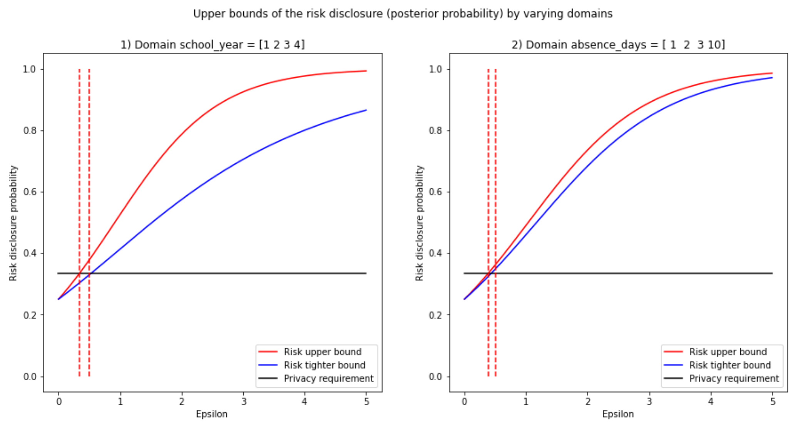
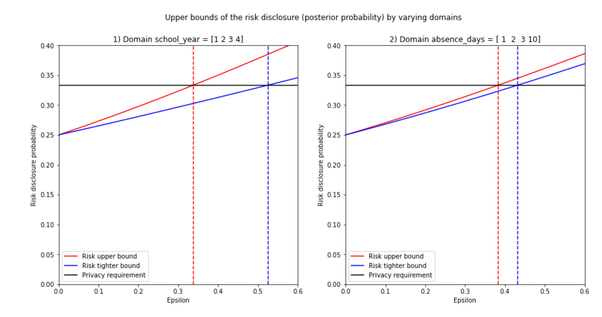
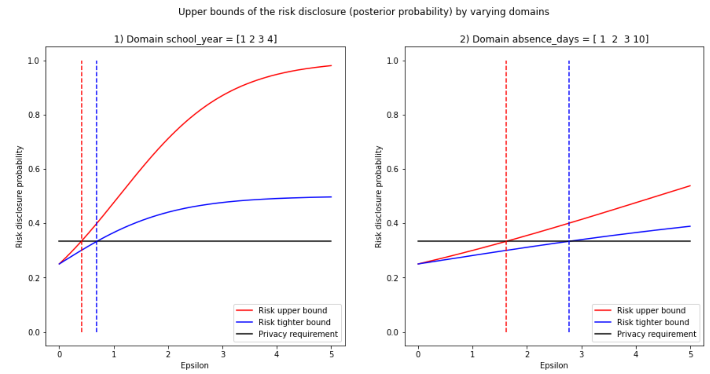

# Choosing Epsilon for Differential Privacy

## Goal

The [notebook](https://github.com/gonzalo-munillag/Blog/blob/main/Extant_Papers_Implementations/A_method_to_choose_epsilon/How_much_is_enough_Calculating_An_Optimal_Epsilon_Last_version.ipynb) behind this post implements the following paper from 2011 with around 20 citations, **[How Much Is Enough? Choosing Epsilon for Differential Privacy](https://link.springer.com/chapter/10.1007%2F978-3-642-24861-0_22)**

## Paper summary

Even though Differential Privacy (DP) in principle protects any individual in a dataset by cloaking with noise the result of an analytics query, DP has its limitations. 
The limitation addressed in this paper is based on the finite amount of dataset possibilities that a worst-case adversary model (Almost perfect background knowledge and infinite computation power) considers after seeing the output of the DP query.
Because some actual dataset distributions are more likely than others, the adversary can update his/her knowledge more efficiently. Therefore, this imbalance needs to be taken into consideration when calculating epsilon. The authors formulated a tight bound for epsilon with binary search based on disclosure risk acknowledging this DP defect.
My humble opinion is that the paper is concise, elegant, and can take your understanding of DP further. I would like to thank the authors Jaewoo Lee and Chris Clifton for these days I spent implementing :) Moreover, I invite everyone to look at the paper and check the code to understand it better.
Jump to the replicated figures if you are impatient :)The notebook allows you to expand and test the paper's approach for different queries. They plot the mean query, but I also plotted the median query. I encourage you to get the code and plot, e.g., the variance query.

## Notebook contributions

[Notebook](https://github.com/gonzalo-munillag/Blog/blob/main/Extant_Papers_Implementations/A_method_to_choose_epsilon/How_much_is_enough_Calculating_An_Optimal_Epsilon_Last_version.ipynb)

1. I coded a function that calculates the bounded and unbounded sensitivity of a dataset containing numeric columns. However, how to code the algorithm was not explained in the paper. With these functions, you can also vary the Hamming distance k (Check these functions in GitHub [blog posts](https://github.com/gonzalo-munillag/Blog/tree/main/My_implementations/Global_sensitivity). How does it do it? Empirically - This function creates all possible neighboring datasets with k less or more records for unbounded DP and with the same amount of records but changing k values for bounded DP. Once the function creates the neighboring datasets, it calculates the sensitivity empirically. More specifically, the function calculates the query result for each possible neighboring dataset, calculates all possible L1 norms, and then chooses the maximum. Note that, for simplicity's sake for unbounded DP, the function selects the largest sensitivity between the two paradigms: one more record or one less record.
3. I found no mistakes in the paper, only a typo in a number in a formula. The numerator should be 0.3062 and not 0.3602 on page 333 (Page 9 of the PDF). 
4. I coded the formulas for a uniform prior, posterior, upper, and tighter bound of the posterior for any given dataset and a set of query types.
5. I coded the binary search explained in the paper to find the correct epsilon value (Given a disclosure risk) for any query type.
6. With this code, you can easily play by using larger or different datasets than the one used in the paper. I used that exact data to replicate the results.
7. This notebook implements more queries beyond the mean and the median used for explanations in the paper. I encourage you to try them out!

**IMPORTANT**: The authors use an approximation of sensitivity Δv (Section 5.1  Equations 4,5) based on the released dataset and its neighbors. Furthermore, they use sensitivity based on unbounded DP (Δf) to calculate the upper bound. In this notebook, however, I use the definition for sensitivity based on bounded DP as Δv. I do this because, to the best of my knowledge, bounded DP sensitivity should be equal to the one the authors chose as long as I keep the Hamming distance to 1. However, given that the results obtained are the same as the authors, we can be sure that my approach is correct. Perhaps back then, the terms bounded and unbounded DP were not commonly used.

### Some concepts before we start:

- When I talk about bounded sensitivity, I refer to the sensitivity that comes from a bounded DP definition, i.e., the neighboring dataset is built by changing the dataset's records (Not adding or removing records). E.g., with x = {1, 2, 3} from universe X = {1, 2, 3, 4}, a neighboring dataset in this case would be: x' = {1, 2, 4}
-  When I talk about unbounded sensitivity, I refer to the sensitivity that comes from an unbounded DP definition, i.e., the neighboring dataset is built by adding or removing records. E.g., with x = {1, 2, 3} and universe X = {1, 2, 3, 4}, a neighboring dataset in this case could be: x' = {1, 2} or {1, 3} or {1, 2, 3, 4}
- The prior is the prior knowledge of an adversary, i.e., his/her best guess about which dataset is probably the real one. The paper and this notebook assume a uniform prior.
- The posterior is the updated knowledge of the adversary, i.e., once he/she has seen the query results, the posterior maps a probability to a possible real dataset. The higher it is, the more confident will the adversary be about a dataset being the real one.

**Note**: The author uses "Pr" to denote cumulative distribution functions and "P" to refer to probability density functions. So when you see P(k(w) = x), it is not the point mass at x; instead, the authors refer to the value of the probability density at x. "P" is used in Definition 3 onwards. However, for section 4.1, the author used the cumulative distribution function, using "Pr." For Definition 3, he could have used the cumulative distribution function; qualitatively, the result would be the same. Most importantly, this notation (P(k(w) = x)) is also used in section 5.1.

# Results

This is the plot I replicated faithfully from the paper:

I applied a binary search and found the optimal values for epsilon. Have a look:

I went a step further and also plotted the median and found the optimal values for epsilon. Here is the result:

